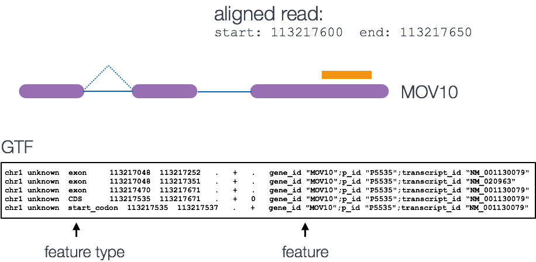
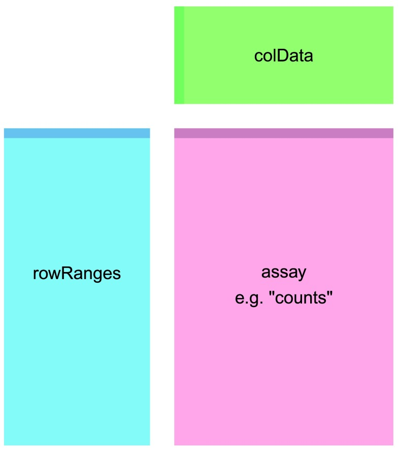
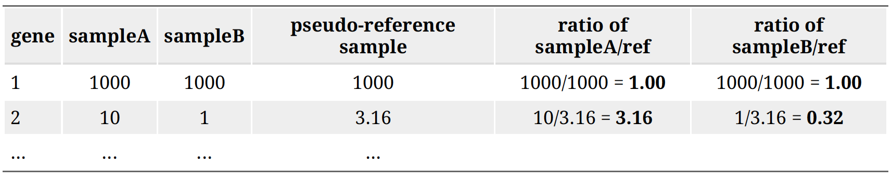

# RNAseq diferential & exploratory analysis

We going to generate BAM files from the FASTQ files you downloaded, anad then do differential gene expresion analysis in R. There are six yeast RNAseq samples.

```{r setup, include=FALSE}

# default to not showing code, you can change it for chunks as you like
knitr::opts_chunk$set(message = FALSE, warning = FALSE)


```

Load packages, install if necessary
```{r LoadPackages, results='hide', message = FALSE,include=FALSE}

packages <- c("apeglm","DESeq2" ,"devtools", "dplyr","edgeR",               
"GenomicAlignments","GenomicFeatures","ggplot2",             
"pheatmap","RColorBrewer","readr","Rsubread")

bioconductor<-function(...) {
    if (
            !require("BiocManager", quietly = TRUE))
            install.packages("BiocManager")
            
    available = BiocManager::available()
    libs<-unlist(list(...))
    req<-suppressWarnings(unlist(
      lapply(libs,require,character.only=TRUE)))
    need<-libs[req==FALSE]
    n<-length(need)
    if(n==0) invisible(lapply(libs,library,character.only=TRUE))
          
    if(n>0){
        libsmsg<-if(n>2) paste(paste(need[1:(n-1)],collapse=", "),",",sep="") else need[1]
       
        if(n==1){ libsmsg<-need[1]}
        if(n>1){
            libsmsg<-paste(libsmsg," and ", need[n],sep="")
        }
        libsmsg<-cat(paste("The following packages could not be found: ",libsmsg,"\n\r\n\rInstall missing packages?",collapse=""))
        
        answer = menu(c("Yes", "No"))
        if(answer != 1) {cat("Nothing done\\n")} else {
         
        
            
          ins = setdiff(need,available) 
          wneed = which(need %in% ins)
          if (length(wneed) > 0) need=need[-wneed]
          wav = which(need %in% available)
          
          if (length(ins) > 0) {install.packages(ins)
          invisible(lapply(ins,library,character.only=TRUE))
        
          } 
            
            if (length(need) > 0) {
            
            BiocManager::install(need)
           
            invisible(lapply(need[wav],library,character.only=TRUE))}
        }
        
    }
}

    
bioconductor(packages)    
          
    
   
```

## Differential Expression Testing

Read the documents: https://bioconductor.org/packages/release/bioc/vignettes/DESeq2/inst/doc/DESeq2.html


In this exercise we are going to walk through the NGS pipeline for rna-seq, starting from FASTQ files and ending with analyzed rna-seq data. While this is running we will try and see if we can recapitulate this in the command line using a shell script. The workflow in this process begins with 


In order to generate a count matrix from FASTQ reads, we need to 1) index the reference file to the genome we are working with, 2) process our raw FASTQ reads, 3) perform quality checks, 4) align the samples to the genome and 4) assemble the alignment to generate the count matrix, as shown in the figure above.

We can do this in R using the Rsubread package, but it is rather slow. 
So what we are going to do while it is running is to run the same process in
the command line using the Conda subread package. The results should be identical, but it will be nice for you to get a feel for both.

Step 1. Indexing the reference genome. Why does it mean to we index a reference file? Indexing a genome can be explained similar to indexing a book. If you want to know on which page a certain word appears or a chapter begins, it is much more efficient/faster to look it up in a pre-built index than going through every page of the book until you found it. Same goes for alignments. Indices allow the aligner to narrow down the potential origin of a query sequence within the genome, saving both time and memory.

To index the reference file we need the reference genome file Saccharomyces_cerevisiae.R64-1-1.dna.toplevel.fa.gz that contains all of the DNA sequences. We also need the gtf file which contains GTF file which contains all of the genomic features, exons, transcripts, genes noncoding regions etc. If we run the alignments and generate the counts in R using this package with the same parameters as we use in subread they should generate identical count matrices. The R version takes about 20' to run. Make sure you have a copy of Saccharomyces_cerevisiae.R64-1-1.96.gtf.gz and Saccharomyces_cerevisiae.R64-1-1.dna.toplevel.fa.gz in your appropriate directories as listed below. 

So we can run this first bit which sets up the names of the files:

```{r ReadingData}

setwd("~/Documents/RProjects/genomics/RNA-genomics")
fastq = list.files("FASTQ")
g = grep("fastq.gz",fastq)
fastq = fastq[g]
fastq.files = paste("FASTQ",fastq,sep = "/")
fastq.files = file.path("FASTQ",fastq)

# here we are just generating the names of the bamfiles
# since  we want to distinguish these from the bamfiles
# we generated in the terminal, lets put them in a different folder
# let's make that folder
# 
bam = gsub("FASTQ/","RBAM/",fastq.files)
bam = gsub(".fastq.gz",".bam",bam)


bam.files = bam
gtf.file = "FASTQ/r64/Saccharomyces_cerevisiae.R64-1-1.96.gtf.gz"

bam.files
gtf.file
fastq.files
```

Here before we start we want to make a folder r64 in the RNA-genomic directory and then set eval = TRUE. Now we'll run the indexing of the reference:
```{r eval=FALSE}

# first build the index
library(Rsubread)
Rsubread::buildindex(basename="r64/r64.index", memory = 1000,
reference="FASTQ/r64/Saccharomyces_cerevisiae.R64-1-1.dna.toplevel.fa.gz")


```


Step 2. Align the reads. We will go with the default parameters EXCEPT
we will add the argument sortReadsByCoordinates=TRUE which will be convenient for downstream analysis. I also set nthreads to 64, which is the physical core of a CPU to help speed things up -- 64 is the maximum for my computer -- but the number of threads you use doens't seem to help the speed much.

OK, let's start this and go back to our shell script. First I have to set eval = TRUE again.
```{r eval=FALSE}

# report the best mapping location:
Rsubread::align(index = "r64/r64.index", readfile1 = fastq.files,
output_file = bam.files,useAnnotation=TRUE,annot.ext = gtf.file,isGTF = TRUE,nthreads=64,sortReadsByCoordinates=TRUE, 
unique=FALSE,nBestLocations = 1)
```

Step 3. Count the reads. Once we have our reads aligned to the genome, the next step is to count how many reads have mapped to each gene as a measure of gene expression. There are many tools that can use BAM files as input and output the number of reads (counts) associated with each feature of interest (genes, exons, transcripts, etc.). Two commonly used counting tools are featureCounts and summarize overlaps.Counting reads is not a straight forward task and there are many factors that bias the final count tally.

The last panel of this figure should read BAM ready for count calling:


The above tools report the “raw” counts of reads that map to a single location (uniquely mapping) and are best at counting at the gene level. Essentially, total read count associated with a gene (meta-feature) = the sum of reads associated with each of the exons (feature) that “belong” to that gene.

There are other tools that will count multimapping reads (sequences that align to more that one position in the genome), but this is a dangerous thing to do since you will be overcounting the total number of reads which can cause issues with normalization and eventually with accuracy of differential gene expression results -- but this is arguable. In RNA-seq, you want to know the total number of transcripts of a particular gene regardless of where it is in the genome and ignoring these genes can lead to missing a lot of genes that may be duplicated in the genome, particularly as these genes are often under the same regulatory control.

Tools for counting require as input multiple BAM files a GTF file which contains all of the genonomic features, exons, transcripts, genes noncoding regions etc.



The genomic coordinates of where the BAM reads are mapped are cross-referenced with the genomic coordinates of whichever feature you are interested in counting expression of (GTF), it can be exons, genes or transcripts.

Output of counting = A count matrix, with genes as rows and samples are columns


These are the “raw” counts and will be used in statistical programs downstream for differential gene expression.

Counting using featureCounts
featureCounts is frequently used because it is accurate, fast and is relatively easy to use. It also has a lot of options that other software tools don't have. featureCounts counts reads that map to a single location (uniquely mapping) and discards reads that are ambiguous, following the scheme in the figure below using the gtf file and BAM files as input.


FeatureCounts has an option to count multi-mapping reads, that most other counting software tools don't have. "Multi-overlapping" reads are reads that overlap with more than one position in the chromosome, but do not overlap more that one feature -- not to be confused with "multi-mapping" reads where a read overlaps more than one feature in the genome. For RNA-seq data, a read is called as a multi-mapping read if it has two or more candidate mapping locations that have the same number of mis-matched bases and this number is the smallest in all candidate
locations being considered, and not more than 3 mismatches. FeatureCounts is a widely used tool and the consensus is that these multi-mapping reads should not be counted in a RNA-seq experiment because such reads are ambiguous as it is unclear which gene they originated from. 


Genomic multireads are primarily due to repetitive sequences or shared domains of paralogous genes. The literature for best practices for RNA seq they explicitly state that these sequences should not be discarded as they normally account for a significant fraction of the mapping output when mapped onto the genome. When the reference is the transcriptome, multi-mapping arises even more often because a read that would have been uniquely mapped on the genome would map equally well to all gene isoforms in the transcriptome that share the exon. In either case — genome or transcriptome mapping — transcript identification and quantification become important challenges for alternatively expressed genes. For this reason we have decided to include these features in our analysis. 


featureCounts in RStudio is extensive, and not all the options are set to the same defaults as the ones in the terminal that you can see by typing 
typing featureCounts -h. So even though the Conda package subread and the R package Rsubread come from the same source, the options are are not the same, and pretty complicated.

```{r featureCounts}

library(Rsubread)

fc <- featureCounts(bam.files, annot.ext=gtf.file, 
isGTFAnnotationFile=TRUE,
isPaired=FALSE, 
###################
allowMultiOverlap = FALSE,countMultiMappingReads = TRUE)
##################

```

Another method of extracting count files from BAM files is by using `summarizeOverlaps` from the GenomicAlignments package. `summarizeOverlaps` uses only the exons extracted from the TxDb object (which stores relationships between pre-processed mRNA transcripts, exons, protein coding sequences, and genes construncted from the gtf file.

We specify a number of arguments besides the features and the reads. 
The mode argument describes what kind of read overlaps will be counted, as in featureCounts (see below). Note that fragments will be counted only once to each gene, even if they overlap multiple exons of a gene which may themselves be overlapping.


```{r summarizeOverlaps}

library(GenomicFeatures)
txdb <- makeTxDbFromGFF(gtf.file, format="gtf")
exons.by.gene <- exonsBy(txdb, by="gene")

library(Rsamtools)

bam.list <- BamFileList(bam)

library(GenomicAlignments)

# ignore.strand=TRUE -- the prep was not generated by a strand-specific protocol,
# inter.feature=TRUE -- when FALSE, these reads are retained and counted once for each feature they map to 
se <- summarizeOverlaps(exons.by.gene, bam.list, mode=Union,
       inter.feature=TRUE, singleEnd=TRUE,ignore.strand = TRUE)

```

Now let's plot the two against each other to see how they compare.

Compare summarizedOverlaps to featureCounts: 
```{r}
m=match(rownames(assay(se) ),rownames(fc$counts))

plot(assay(se[,1]),fc$counts[m,1],ylab = "featureCounts",xlab = "summarizeOverlaps",pch=19)
abline(a=0,b=1)


table(assay(se)==fc$counts[m,])

cor.test(assay(se),fc$counts[m,])

counts = fc$counts 

g = grep("^Y",rownames(counts))
counts = counts[g,]
counts = counts[order(rownames(counts)),]
# Let's give the original names back to the samples

# From the script subreadMapping.sh
cnts = read_tsv("counts.txt",skip = 1)
cts = as.matrix(cnts[,7:12])
rownames(cts)=cnts$Geneid
gg= grep("^Y",cnts$Geneid)
cts = cts[gg,]
cts = cts[order(rownames(cts)),]

colnames(cts)=basename(colnames(cts))

table(counts == cts)

cor.test(counts,cts)
```

You can see that the summarizedOverlaps is identical to the featureCounts method of counting reads. And our count matrix generated in the terminal is nearly identical to the one generated in R. The reason it is not identical is because of the parameter nBestLocations. When there are multiMapped reads greater than the number of nBestLocations, the program selects nBestLocations randomly out of those found. 

se is a summarized experiment. A word about summarized experiments. The way summarized experiments are set up is that the rownames of the colData or metadata, also sometimes called phenoData, must match the colnames of the assay data -- the count data or expression data. Similarly, the rownames of the assay data must match the rowRanges of the featureData. This is all part of Bioconductor's way of standardizing structures so that they work well with each other across and within packages.



Translating orf names to gene names:
```{r annotation}

library(org.Sc.sgd.db)
eid = keys(org.Sc.sgd.db)
gene=AnnotationDbi::mapIds(org.Sc.sgd.db, keys = eid, column = "GENENAME", keytype = "ORF")

m=match(rownames(counts),names(gene))

table(is.na(m))

wna = which(is.na(gene))

gene[wna]=names(gene)[wna]

length(wna)
genecnts = counts
rownames(genecnts)=gene[m]
```


Let's rename our colnames of counts from bamfile names back to our original sample names before we start our differential analysis:
```{r rename}

library(readr)
library(dplyr)
meta <- read_csv("https://osf.io/cxp2w/download")
meta = meta[,-2]
names(meta)[2] = "genome"
meta$genome = factor(meta$genome)
meta$genome = relevel(meta$genome,ref = "wt")
# make wild-type the reference to which expression in snf2 samples is compared to
meta = meta %>% dplyr::arrange(sample)
meta$sample
meta = data.frame(meta,stringsAsFactors = F)
rownames(meta)=meta$sample
colnames(counts) = gsub(".bam","",colnames(counts))
```

Looks good, this meets the requirement of a summarized experiment:
```{r}
colnames(counts) == meta$sample
```

## DESeq2 workflow


To run DESeq2 analysis, you have to check to make sure that all rows labels in meta are columns in data:
```{r}
all(colnames(counts) == rownames(meta))
```


Create the dataset and run the analysis:
```{r}

dds <- DESeqDataSetFromMatrix(countData = counts, colData = meta, design = ~genome)

dds$genome <- relevel(dds$genome, ref = "wt") # make wild-type the reference to which expression in treatment samples is compared to 
dds <- DESeq(dds)
```

- **Read in Data**

We've already read in the metadata for our experiment, let's view it:
```{r}
glimpse(meta)
```


Behind the scenes these steps were run in DESeq2 function:

1.estimating size factors
2.gene-wise dispersion estimates
3.mean-dispersion relationship
4.final dispersion estimates
5.fitting model and testing

The design formula `design = ~genome` tells DESeq2 which factors in the metadata to test, such as control v.s. treatment. Here our condition is wt v.s. snf2 as shown in the `meta`.

The design can include multiple factors that are columns in the metadata. In this case, the factor that you are testing for comes last, and factors that you want to account for come first. E.g. To test for differences in condition while accounting for sex and age: `design = ~ sex + age + condition`. 



- **Unsupervised Clustering**

This step is to asses overall similarity between samples:
1.Which samples are similar to each other, which are different?
2.Does this fit to the expectation from the experiment’s design?
3.What are the major sources of variation in the dataset?

To accomplish this we use Principle component analysis. Principal component analysis (PCA) is a mathematical algorithm that reduces the dimensionality of the data while retaining most of the variation in the data set1. It accomplishes this reduction by identifying directions, called principal
components, along which the variation in the data is maximal. By using a few components, each sample can be represented by relatively few
numbers instead of by values for thousands of variables. Samples can then be plotted, making it possible to visually assess similarities and differences
between samples and determine whether samples can be grouped. PCA can be used to represent samples with a smaller number of variables, visualize samples and genes, and detect dominant patterns of gene expression. PCA is extremely powerful for use in exploring large-scale data sets in which
thousands of variables have been measured. It can act as a quick gut check to test whether your data is in aligning with your metadata, for example. 

- **Principle Components Analysis**

Here we use the built in function plotPCA from DESeq2 (built on top of ggplot). The regularized log transform (rlog) improves clustering by log transforming the data.

```{r, fig.width = 5, fig.height = 15}
rld <- rlog(dds, blind=TRUE)

```


- **Creating contrasts and running a Wald test**

The null hypothesis: log fold change = 0 for across conditions. P-values are the probability of rejecting the null hypothesis for a given gene, and adjusted p values take into account that we've made many comparisons:
```{r}
contrast <- c("genome", "wt", "snf2")
res_unshrunken <- DESeq2::results(dds, contrast=contrast)
summary(res_unshrunken)

# or

res_unshrunken <- DESeq2::results(dds, name  = "genome_snf2_vs_wt")

```

Here shows a summary of up- or down-regulated genes:

- **Shrinkage of log fold change of genes with very low expression.**
Genes with very low expression usually have very noisy estimates of log2 fold changes. It is desirable to shrink the fold change of genes with low read counts, but not shrink the fold change of highly expressed genes too much. DEseq2 has implemented several different algorithms for shrinkage. The DESeq2 developers recommend to use apeglm method for shrinkage. Shrinkage is especially important if you plan to use LFC to rank genes for enrichment analysis (e.g., GSEA, to be covered next week).

One more step where information is used across genes to avoid overestimates of differences between genes with high dispersion. This is not done by default, so we run the code:
```{r}

res <- lfcShrink(dds, coef ="genome_snf2_vs_wt", type="apeglm")

# or

res <- lfcShrink(dds, coef =2, type="apeglm")

```

## Visualizing RNA-seq results 

Brief interlude: introduction to ggplot:

ggplot is an plotting method in R with the following arguments:

ggplot(data = <DATA>, mapping = aes(<MAPPINGS>)) +  <GEOM_FUNCTION>()


```{r}
animals <- read_csv("data/surveys_complete.csv")
glimpse(animals)
names(animals)
```


use the `ggplot()` function and bind the plot to a specific data frame using the `data` argument
```{r eval = FALSE}
ggplot(data = animals)
```

- define an aesthetic mapping (using the aesthetic (`aes`) function), by
selecting the variables to be plotted and specifying how to present them in the
graph, e.g., as x/y positions or characteristics such as size, shape, color, etc.
```{r, eval = FALSE}
ggplot(data = animals, mapping = aes(x = weight, y = hindfoot_length))
```


finally add 'geoms' – graphical representations of the data in the plot (points,
  lines, bars). **`ggplot2`** offers many different geoms; we will use some
  common ones today, including:

  * `geom_point()` for scatter plots, dot plots, etc.
  * `geom_boxplot()` for, well, boxplots!
  * `geom_line()` for trend lines, time series, etc.  

To add a geom to the plot use `+` operator. Because we have two continuous
variables, let's use `geom_point()` first:
```{r first-ggplot}
ggplot(data = animals, mapping = aes(x = weight, y =      hindfoot_length)) + geom_point()
```

The `+` in the **`ggplot2`** package is particularly useful because it allows you to modify existing `ggplot` objects. This means you can easily set up plot "templates" and conveniently explore different types of plots, so the above
plot can also be generated with code like this:
```{r, first-ggplot-with-plus}
# Assign plot to a variable
animals_plot <- ggplot(data = animals,
                       mapping = aes(x = weight, y = hindfoot_length))

# Draw the plot
animals_plot +
    geom_point()
```

```{r, eval = FALSE, purl = TRUE, echo = FALSE, purl = FALSE}
## Create a ggplot and draw it.
animals_plot <- ggplot(data = animals,
                       aes(x = weight, y = hindfoot_length))

animals_plot +
  geom_point()
```

Add color:
```{r}
animals_plot <- ggplot(data = animals,
                       mapping = aes(x = weight, y = hindfoot_length, col = animals))

animals_plot +
  geom_point()

```

```{r}
## Create a ggplot and draw it.
animals_plot <- ggplot(data = animals,
                       aes(x = weight, y = hindfoot_length))

animals_plot +
  geom_point(alpha = 0.1, aes(color = species_id))
```

Different geometry:
```{r}
animals_plot <- ggplot(data = animals,
                       aes(x = species_id, y = weight, col = species_id))

animals_plot +
  geom_point()
```
Same plot, different geometry
```{r}
animals_plot +
  geom_boxplot()
```
Same plot, jitter, log10 y-axis
```{r}
animals_plot +
  scale_y_log10()+
  geom_boxplot() +
  geom_jitter(alpha = 0.3,size=1)
```
Adding layer after layer...

## Visualizing RNA-seq results 

**Count Data Transformations:** 
<<<<<<< HEAD
To improve the distances/clustering for the PCA and heirarchical clustering visualization methods, we need to moderate the variance across the mean by applying the `rlog` transformation to the normalized counts.

The the `rlog` transformations of the normalized counts is only necessary for these visualization methods during  quality assessment. We will not be using these tranformed counts downstream.

=======
To improve the distances/clustering for the PCA and heirarchical clustering visualization methods, we use the `rlog` transformations of the normalized counts. Using rlog transformation is only necessary visualization methods during  quality assessment. We will not be using these tranformed counts downstream.

>>>>>>> bfcd84f (exploratory)
**rlog**: "transforms the count data to the log2 scale in a way which minimizes differences between samples for rows with small counts, and which normalizes with respect to library size. The transformation is useful for quality control.

```{r, cache=TRUE}
rld <- rlog(dds, blind=TRUE)
head(assay(rld), 3)
```

<<<<<<< HEAD
## Components of the PCA analysis - Variance explained
The statistical interpretation of singular values is in the form of variance in the data explained by the various components. The singular values produced by the `prcomp` (a function in R that produces principal components, along with `svd`) are in order from largest to smallest and when squared are proportional the amount of variance explained by a given singular vector.

=======

## PCA analysis - Variance explained
Principal component analysis (PCA) can be used to visualize variation between expression analysis samples. This method is especially useful for quality control, for example in identifying problems with your experimental design, mislabeled samples, or other problems.

When you perform a PCA, the normalized differences in expression patterns are used to compute a distance matrix. The X- and Y-axes in a PCA plot correspond to a mathematical transformation of these distances so that data can be displayed in two dimensions. PCA is typically used primarily as a quality control or exploratory tool. In general, if your samples were produced under two experimental conditions (e.g. treated vs. untreated), the PCA plot should normally show that a) samples subjected to the same condition cluster together, and b) the clusters should be reasonably well-separated along the X-axis (“PC1”: the first principal component).


>>>>>>> bfcd84f (exploratory)
rlog PCA: 
```{r pca_rld}

plotPCA(rld, returnData=TRUE, intgroup = "genome")
data1 <- plotPCA(rld, returnData=TRUE, intgroup = "genome")
#data1$group<-gsub(" : ","_",as.character(data1$group))
percentVar1 <- round(100 * attr(data1, "percentVar"))

PCA<-ggplot(data1, aes(PC1, PC2, color = genome))+ theme_bw()+
  geom_point(size=9, alpha = 0.8) + scale_colour_manual(values = c("#44aabb","#bbbbbb"))+
  xlab(paste0("PC1: ",percentVar1[1],"% variance")) +
  ylab(paste0("PC2: ",percentVar1[2],"% variance")) +
  theme(text = element_text(size=20)) + ggtitle("rlog PCA")
PCA

```

## HeatMaps

rlog HeatMap:

To make heatmaps we need colors. The RColorBrewer package is a nice choice for this. RColorBrewer has several palettes, there are three types: "div","seq" and "qual". You can check them out typing:
```{r}

library(RColorBrewer)

for (i in 1:5) {

display.brewer.all(n=NULL, type="all", select=NULL, exact.n=TRUE,colorblindFriendly=FALSE)

display.brewer.all(type="div")

display.brewer.all(type="seq")

display.brewer.all(type="qual") 

display.brewer.all(colorblindFriendly=TRUE)}
```

Each palette has a defined set of colors. To get a list of the palettes type:

```{r}
brewer.pal.info
```

To use a palette, simply type `brewer.pal` followed by the number of colors you want and the name of the palette, e.g.:

```{r}
set1 = brewer.pal(8, "Set1")
```

In a heatmap we are simply representing numbers by colors. We are plotting our top 500 differentially expressed genes in our results table: snf2 versus wt. This heatmap enables us to see the expression of these genes in all the samples from the count matrix.
```{r heatmap_rld}

df <- as.data.frame(colData(rld)[,c("genome", "sample")])

# lists of colors
mat_colors1<-list(sample = brewer.pal(12, "Paired")[0:6])
names(mat_colors1$sample)<- df$sample

mat_colors <- list(genome = brewer.pal(12, "Paired")[9:10])
names(mat_colors$genome) <- c("wt", "snf2")

genes <- order(res$padj)[1:20]

<<<<<<< HEAD
pheatmap(assay(rld)[genes, ], cluster_rows=TRUE, show_rownames=FALSE,
         cluster_cols=FALSE, annotation_col=df, annotation_colors = c(mat_colors1, mat_colors), fontsize = 12)
```


=======
p=pheatmap(assay(rld)[genes, ], cluster_rows= TRUE, show_rownames=FALSE,
         cluster_cols=TRUE, annotation_col=df, annotation_colors = c(mat_colors1, mat_colors), fontsize = 12)
```

```{r}
des = data.frame(res,stringsAsFactors = F)
des$orf=rownames(des)
des = des%>% arrange(padj,desc(abs(log2FoldChange)))
w=which(des$padj<0.05&abs(des$log2FoldChange)>2)
genes = which(rownames(rld)%in%des$orf[w])

pheatmap(assay(rld)[genes, ], cluster_rows=TRUE, show_rownames=FALSE,scale = "row",
         cluster_cols=TRUE, annotation_col=df, annotation_colors = c(mat_colors1, mat_colors), fontsize = 12)

```


>>>>>>> bfcd84f (exploratory)
Another option for heat maps: 
plot the difference from the mean normalized count across samples 
(and optionally change default colors)

With Rlog transformed data:
```{r heatmap_rld_meandiff}

pal <- brewer.pal(9,"YlOrRd")

mat_colors1<-list(sample = brewer.pal(6 ,"Set2"))
names(mat_colors1$sample)<- df$sample

mat_colors <- list(genome = brewer.pal(2,"Set3")[1:2])
names(mat_colors$genome) <- c("wt", "snf2")

mat <- assay(rld)[genes, ]
mat <- mat - rowMeans(mat)

df <- as.data.frame(colData(rld)[,c("genome", "sample")])

pheatmap(mat,  cluster_rows=TRUE, show_rownames=FALSE,
         cluster_cols=TRUE, annotation_col=df, annotation_colors = c(mat_colors1, mat_colors), fontsize = 12, color = pal)

```

Heatmap of sample-to-sample distances
```{r heatmap_sampledistance}
sampleDists <- dist(t(assay(rld)))
sampleDistMatrix <- as.matrix(sampleDists)
rownames(sampleDistMatrix) <- paste(rld$genome, rld$type, sep="-")
colnames(sampleDistMatrix) <- NULL
colors <- colorRampPalette( rev(brewer.pal(9, "Blues")) )(255)
pheatmap(sampleDistMatrix,
         clustering_distance_rows=sampleDists,
         clustering_distance_cols=sampleDists,
         col=colors)
```

The summary of results after shrinkage can be viewed by typing `summary(res)` or `head(res)`. If you used `head(res)` you will be viewing the top few lines of the result containing log2 fold change and p-value. log2FoldChange = log2(snf2count/wtcount) Estimated from the model. padj - Adjusted pvalue for the probability that the log2FoldChange is not zero.


## Saving results
Now you have the table with log2 fold change and you might want to save it for future analysis. A adj value cutoff can be applied here. For example, here p-adj 0.05 is used.

```{r}
## Filtering to find significant genes
padj.cutoff <- 0.05 # False Discovery Rate cutoff
significant_results <- res[which(res$padj < padj.cutoff),]

## save results using customized file_name
file_name = 'significant_padj_0.05.txt'
# write.table(significant_results, file_name, quote=FALSE)
```

Now you have your analyzed result saved in txt file, which can be imported to Excel.

- **Exit R and save the work space**

If you want to take a break and exit R, type `q()`. The workspace will be automatically saved with the extension of `.Rproj`.

## Review DeSeq2 workflow
These comprise the full workflow:
```{r eval=FALSE}
# Setup DESeq2
dds <- DESeqDataSetFromMatrix(countData = counts, colData = meta, design = ~genome)
# Run size factor estimation, dispersion estimation, dispersion shrinking, testing
dds <- DESeq(dds)
# Tell DESeq2 which conditions you would like to output
contrast <- c("genome", "snf2", "wt")
# Output results to table
res_unshrunken <- results(dds, contrast=contrast)
# Shrink log fold changes for genes with high dispersion
res <- lfcShrink(dds, contrast=contrast, res=res_unshrunken, type = "apeglm")

```

Run DESeq2: 
```{r, cache = TRUE}
dds <- DESeq(dds)
```

Check out results: 
```{r}
resultsNames(dds)
res <- results(dds,name = "genome_snf2_vs_wt")
head(res)
```

Summarize results
```{r}
summary(res, alpha = 0.05) # default significance cut-off is 0.1, changing alpha to 0.05 changes the significance cut-off 
```


## Plotting single genes
Now, you can explore individual genes that you might be interested in. A simple plot can be made to compare the expression level of a particular gene. For example, for gene "YOR290C":
```{r}
par(pch=19)
plotCounts(dds, gene="YOR290C", intgroup="genome")
```

IGV

The Integrative Genomics Viewer (IGV) is a high-performance, easy-to-use, interactive tool for the visual exploration of genomic data. It supports flexible integration of all the common types of genomic data and metadata, investigator-generated or publicly available, loaded from local or cloud sources.

Development of IGV has been supported by funding from the National Cancer Institute (NCI) of the National Institutes of Health, the Informatics Technology for Cancer Reserarch (ITCR) of the NCI, and the Starr Cancer Consortium.

[James T. Robinson, Helga Thorvaldsdóttir, Wendy Winckler, Mitchell Guttman, Eric S. Lander, Gad Getz, Jill P. Mesirov. Integrative Genomics Viewer. Nature Biotechnology 29, 24–26 (2011).](https://www.ncbi.nlm.nih.gov/pmc/articles/PMC3346182/)

https://software.broadinstitute.org/software/igv/download


For this exercise we’ll be making use of IGV that you downloaded. The Saccharomyces cerevisiae genome that we used for the mapping is available here. It can be found under Genome -> S. cerevisiae (sacCer3)

The BAM files can be added tracks. Choose “Tracks -> local file”. Select all the .bam files and the accompanying .bai files.

You should get something like this:


If we want to see our reads we have to zoom in. Unfortunately, the web app doesn't make it easy to search for genes so we have to do it the hard way.

Question: pick five of your top hits in the DESeq2 analysis and see if they check out.


